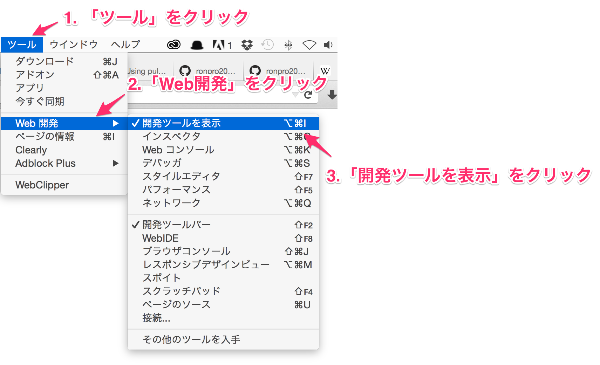
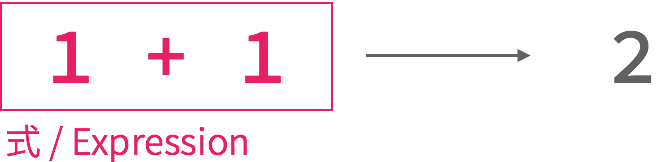
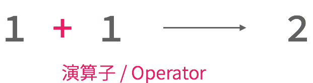
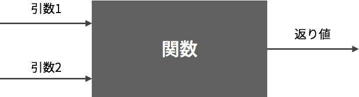

# 情報基礎2\#2

慶應義塾大学環境情報学部
清水智公 (chiko@tom.sfc.keio.ac.jp)

---

## この講義の目的

* 作り手になろう
* プログラミングは、最も簡単な生産方法の1つ
* Webは、最もお手軽なプログラミング環境の1つ

----

## 採点の要素

* 中間試験（第7回に予定）
* 最終発表と成果物
* 日々の講義への貢献

----

## 休講と補講の予定

日時|内容|メモ
---|---|--
2016/06/16|休講|
2016/07/21|休講|
2016/07/16|補講|2,3,4,5 限に補講をします

----

## 担当教員：清水智公

<ul>
<liしみずのりただ / [@chikoski](https://twitter.com/chikoski)</li>
<li>SFC歴 18年目</li>
<li>[Mozilla Japan](http://www.mozilla.jp)</li>
<li>プログラミング言語、機械学習</li>
</ul>

---

## 環境を作ろう

* [Firefox Developer Edition](https://www.mozilla.org/firefox/developer/)のインストール
* [Visual Studio Code](https://www.visualstudio.com/ja-jp/products/code-vs.aspx)のインストール
* [node.js](https://nodejs.org/) のインストール
* [Github](https://github.com/)へのサインイン
* [Github Desktop](https://desktop.github.com/)のインストール

----

## [IDを教えてください](https://docs.google.com/forms/d/1vbY8Tz0qgGAYqE9E3JnC2r4F3ZWli429aUzb8nYz78E/viewform)

---

## 今日の内容

* 数値を対象とした式の評価
* 変数とその操作
* 関数呼び出しと関数宣言

---

## 対話的な JavaScript の実行

1. コピーした index.html を Firefox で表示
2. 「ツール」→「開発ツール」→「コンソールの表示」
3. コンソールに JavaScript を入力して実行する

----

### コンソールの表示

---

## コンソールで次を実行しよう

~~~javascript
1 + 2
3 * 5
1 * 2 * 3 + 4
10 % 7
86418 % 7
Number.POSITIVE_INFINITY * 2
Number.POSITIVE_INFINITY + Number.NEGATIVE_INFINITY
Number.MAX_VALUE
Number.MAX_VALUE + 1
~~~

---

## 式と評価

----

### 式と評価（つづき）

----

### 式と評価（つづき）

---

## 算術演算

* 数値と数値の演算
* 加算、除算、乗算、除算、剰余 の 5 種類
* 算術演算子を用いて記述する

----

### 算術演算子

|演算子|役割|例|評価値|
|----|---|--|----|
|+|二つの値の足し算|3.14+1|4.14|
|-|二つの値の引き算|3.14-1|2.14|
|*|二つの値の掛け算|3.14*2|6.28|
|/|二つの値の割り算|3.14/2|1.57|
|%|二つの値の割り算の、あまり|10%3|1|

----

### 算術演算の例

~~~javascript
1 + 2;        // 3
12345 - 2345; // 10000
3.14 * 2;     // 6.28
17 / 5;       // 3.4
1234 % 5;     // 4
~~~

---

### 練習問題 1

* 99991 と 96931 の掛け算の結果を 93307 で割った余りを求めよ
* 92431 と 91249 の掛け算の結果を 20879 で割った余りを求めよ
* 上記二つの答えを足し、その結果の各桁の数字を全部足した値を求めよ
* 答えを[このフォーム](http://goo.gl/forms/7uZDq5GsKC) から入力せよ

---

## 関数の呼び出し

~~~javascript
add(1, 2)
add(1, 2) + 1
add(1, add(2, 3)) + 4
add(add(1, 2), add(3, 4)) + 5
~~~

----

----

----

### より複雑な関数の呼び出し

~~~javascript
divide(1, Math.exp(multiply(add(multiply(2, 4), 1), -1)) + 1)
~~~

この関数を計算している：

---

## 変数：計算の途中経過の記憶

~~~javascript
var ix = multiply(2, 4);
var x = add(ix, 1);
var denominator = add(multiply(x, -1), 1);
divide(1, denominator);
~~~

----

### 変数名の宣言

~~~javascript
var a;
var b, c, d;
var e = 10;
~~~

* 記号を変数と明示するため
* カンマ (,) で区切って、複数の変数を1文で宣言できる
* 変数の宣言と、代入を1文で行える

----

### 代入：変数と値の結びつけ

----

### 参照：文の中で変数を利用すること

~~~javascript
var a = 1;
var b = 2;
var c = a + b;
var ix = multiply(a, c);
var x = add(ix, b);
var denominator = add(multiply(x, -1), a);
divide(1, denominator);
~~~

---

## 演算子の優先度

|優先度|演算の種類|演算子|結合性|
|-----|--------|-----|-----|
|19|グルーピング|()|なし|
|17|関数呼び出し|()|左から右へ|
|14|掛け算、割り算、剰余|* / %|左から右へ|
|13|足し算、引き算|+ -|左から右へ|
|3|代入|=|右から左へ|

* 演算子には優先度がある
* 優先度が高い演算が先に評価される
* 同じ優先度の場合は、結合性に従って評価される

---

### 練習問題 2：演算子の優先度

~~~javascript
var a, b, c;
c = (a = (b = 5 * 6 * 7 % 5 % 2 + 1)) + 5;
console.log(c);
~~~

* 実行して、なぜその結果になるのかを考えよ
* console.log は値をコンソールに出力する関数
* [このフォーム](http://goo.gl/forms/Iiw51NCxdW)に2行目の式が評価されていく様子を記入せよ

---

## 関数定義

~~~javascript
function sigmoid(value, gain){
  gain = multiply(gain, -1);
  value = multiply(value, gain);
  var denominator = 1 + Math.exp(value);
  return divide(1, denominator);
}

var a = sigmoid(0, 1);
var b = sigmoid(1, 2);
var c = sigmoid(2 * 4 + 1, 1);
~~~

* プログラムの部分をまとめること
* 多くの場合は、まとめた部分に対して名前をつける
* プログラム作成の効率化、処理の抽象化、可読性の向上

----

### 仮引数

~~~javascript
function sigmoid(value, gain){
  gain = multiply(gain, -1);
  value = multiply(value, gain);
  var denominator = 1 + Math.exp(value);
  return divide(1, denominator);
}
~~~

* 関数定義時には、引数の値は未定
* 計算に利用するため、引数をそれぞれ変数（仮引数）として表現
* 関数定義時に()へ列挙することで、仮引数を宣言できる

----

### 実引数

~~~javascript
function sigmoid(value, gain){
  gain = multiply(gain, -1);
  value = multiply(value, gain);
  var denominator = 1 + Math.exp(value);
  return divide(1, denominator);
}

var a = sigmoid(0, 1);
~~~

* 関数呼び出し時に、引数の値は決定される
* 値が決定した引数を実引数と呼ぶ
* 上記の例では0と1が value と gain に代入され計算が行われる

----

### 返り値

~~~javascript
function increment(value){
  return value + 1;
}

var a = increment(10); //11が代入される
var b = increment(1); // 2 が代入される
~~~

* 返り値：関数の評価値
* 何を評価値とするかは、プログラマが明示する
* return 文を使うと、そのあとの式の評価値が関数の返り値となる

----

### 返り値（つづき）

~~~javascript
function add(a, b){
  return a + b;
  // この行以降は実行されない
  var c = a + b;
  var d = c + c;
  return a + b + c + d;
}
~~~

* return 文を実行すると、その関数内の処理を終了する
* 複数の値を、関数の返り値にはできない
* 複数の値を返したい場合は、Objectとして1つにまとめる必要がある

---

## 練習問題 3：関数呼び出し

~~~javascript
(1 * 2 + 3 * 4) % 5
~~~
これを以下の関数を適切に組み合わせて、書き直せ。

|関数|役割|例|返り値|
|---|---|-|-----|
|add|足し算|add(1, 2)|3|
|subtract|引き算|subtract(3, 2)|1|
|multiply|掛け算|multiply(3, 7)|21|
|divide|割り算|divide(10, 2)|5|
|mod|剰余|mod(10, 7)|3|

---

## 変数のスコープ

~~~javascript
var a = 10;
var b = 2;
var c = 0;

function someFunc(a){
  var c = 10;
  return b * a + c;
}

var d = someFunc(5);
~~~

* d には何が代入されるだろうか？
* 関数呼び出し終了時に、c には何が代入されているだろうか？

----

### 変数のスコープ（つづき）

~~~javascript
var a = 10;
var b = 2;
var c = 0;

function someFunc(a){
  var c = 10;
  return b * a + c;
}

var d = someFunc(5);
~~~

* 関数内でも変数を宣言できる
* 関数内と関数外で同名の変数が宣言されている場合、参照時に関数内のものが利用される
* 関数内で宣言した変数（仮引数も含む）は、関数外で参照できない

---

## 練習問題4：関数定義

* 引数に指定された長さを半径とする円の、円周を返す関数Rを定義せよ
* Math.PI　を参照すると、円周率が得られる
* 関数定義は、js/numeric_functions.js に記述すること
* 記述したらGitHubにコミットすること

---

## 練習問題5：関数定義

* 引数に指定された長さを半径とする円の面積を計算する関数を定義せよ
* 定義する関数の名前は自分で決定すること
* Math.PI　を参照すると、円周率が得られる
* 関数定義は、js/numeric_functions.js に記述すること
* 記述したらGitHubにコミットすること

---

### 練習問題6：関数定義

* 引数に指定された3つの数値を基に、円の面積を計算し、最も大きい面積を返す関数を定義せよ
* 関数名は自分で決定すること
* Math.PI　を参照すると、円周率が得られる
* Math.max は、2つの引数のうち大きい方の値を返す関数である
* 関数定義は、js/numeric_functions.js に記述すること
* 記述したらGitHubにコミットすること

~~~javascript
var a = Math.max(0, 1); // 1 が代入される
var b = Math.max(-100, 100); // 100 が代入される
var c = Math.max(12345, 1); // 12345 が代入される
~~~
